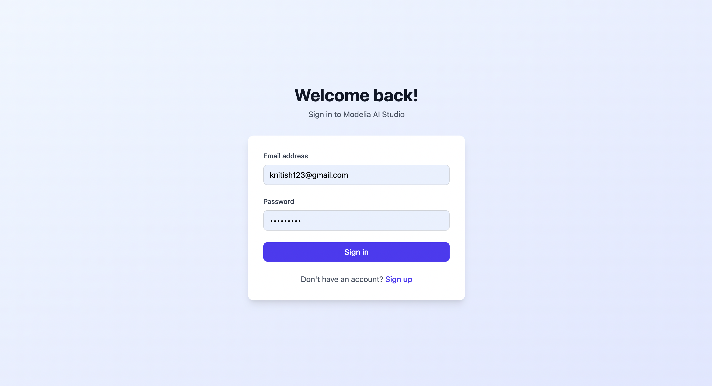
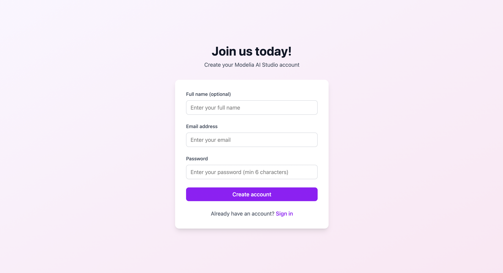
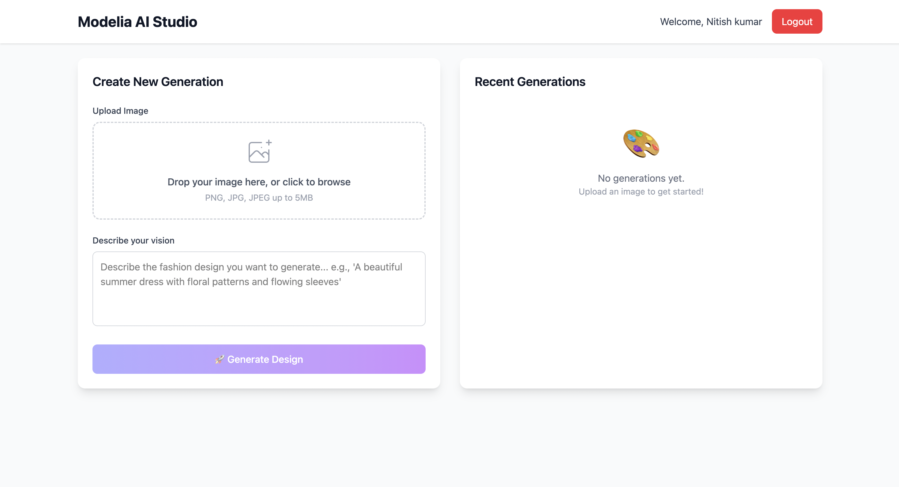
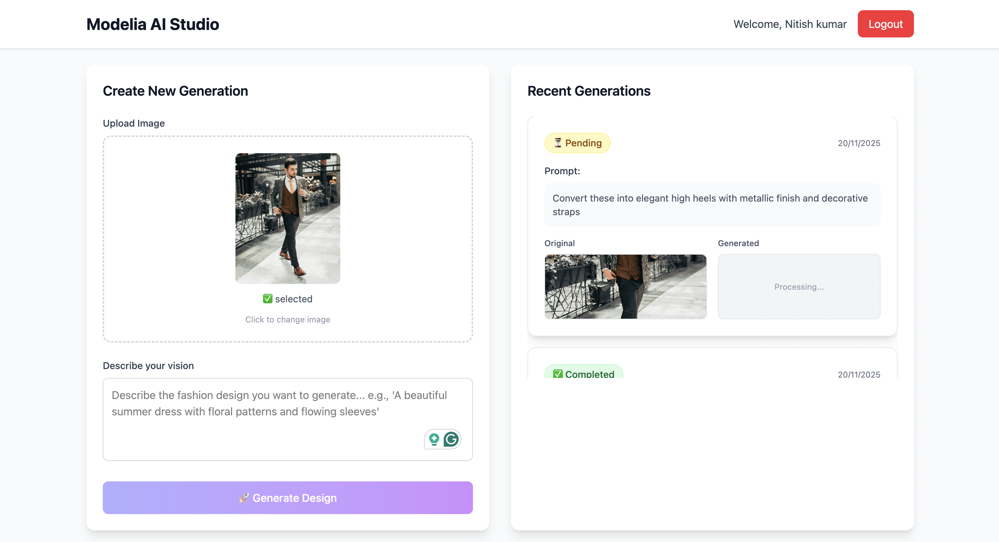

# 🎨 Modelia AI Studio

A full-stack web application for simulating AI-powered fashion image generation with authentication, image upload, and real-time generation tracking.

## 🚀 Live Demo

- **Frontend**: http://localhost:5173
- **Backend API**: http://localhost:3000
- **Health Check**: http://localhost:3000/health

## 📸 Screenshots

### **Authentication System**

| Login Page | Registration Page |
|------------|-------------------|
|  |  |

### **Dashboard & Image Generation**

| Dashboard Overview | Generation Process |
|-------------------|-------------------|
|  |  |

*Beautiful, responsive interface showcasing drag & drop upload, prompt input, and real-time generation tracking*

## ✨ Features

### 🔐 **Authentication System**
- **User Registration** - Create account with email, password, name
- **Secure Login** - JWT-based authentication with 30-day expiry
- **Protected Routes** - Dashboard access for authenticated users only
- **Session Management** - Automatic token validation and refresh

### 🎨 **AI Image Generation**
- **Drag & Drop Upload** - Intuitive image upload with preview
- **Smart Validation** - Supports JPEG, JPG, PNG, WebP (up to 5MB)
- **AI Simulation** - Background processing with 2-5 second delays
- **Error Handling** - 20% random failure rate for robust testing
- **Real-time Status** - Live tracking: pending → completed/failed

### 📱 **Generation Dashboard**
- **Recent History** - Display up to 5 recent generations
- **Status Badges** - Color-coded progress indicators
- **Image Comparison** - Side-by-side original vs generated images
- **Responsive Design** - Beautiful UI optimized for all devices

## 🛠️ Tech Stack

### **Frontend**
- **React 18** + **TypeScript** - Modern component-based UI
- **Vite** - Lightning-fast development and building
- **Tailwind CSS** - Utility-first styling with beautiful gradients
- **React Router** - Client-side routing with protected routes
- **Axios** - HTTP client with interceptors for API calls

### **Backend**
- **Node.js** + **Express** + **TypeScript** - Robust API server
- **Prisma ORM** - Type-safe database operations
- **PostgreSQL** - Production-ready database (Supabase)
- **JWT Authentication** - Secure token-based auth
- **Multer** - File upload handling with validation
- **bcryptjs** - Password hashing and verification

### **Database**
- **PostgreSQL** (Supabase) - Cloud-hosted database
- **Prisma Migrations** - Database schema management
- **User Management** - Secure user data storage
- **Generation Tracking** - Complete generation history

## 📦 Project Structure

```
modelia-ai-studio/
├── backend/                 # Express API server
│   ├── src/
│   │   ├── controllers/     # Request handlers
│   │   ├── services/        # Business logic
│   │   ├── middleware/      # Auth & validation
│   │   ├── routes/          # API endpoints
│   │   └── utils/           # Helper functions
│   ├── uploads/             # Image storage
│   └── prisma/              # Database schema & migrations
├── frontend/                # React application
│   ├── src/
│   │   ├── components/      # UI components
│   │   ├── contexts/        # Global state management
│   │   ├── services/        # API integration
│   │   └── assets/          # Static files
└── shared/                  # Shared TypeScript types
```

## 🚀 Quick Start

### Prerequisites
- **Node.js** 20.19+ or 22.12+
- **npm** or **yarn**
- **PostgreSQL** database (or use our Supabase setup)

### 1. Clone & Install
```bash
git clone <your-repo-url>
cd modelia-ai-studio
npm install
```

### 2. Environment Setup
```bash
# Backend environment
cp backend/.env.example backend/.env
# Edit backend/.env with your database credentials
```

### 3. Database Setup
```bash
cd backend
npx prisma migrate dev
npx prisma generate
cd ..
```

### 4. Start Development Servers
```bash
# Start both frontend and backend
npm run dev

# Or start individually
npm run dev:backend   # http://localhost:3000
npm run dev:frontend  # http://localhost:5173
```

## 📡 API Documentation

### **Authentication Endpoints**
```http
POST /api/auth/register    # Create new account
POST /api/auth/login       # User login
GET  /api/auth/me         # Get current user (protected)
```

### **Generation Endpoints**
```http
POST /api/generations          # Upload image + prompt (protected)
GET  /api/generations          # Get recent generations (protected)
GET  /api/generations/:id      # Get specific generation (protected)
```

### **Example API Usage**
```typescript
// Register user
const response = await fetch('/api/auth/register', {
  method: 'POST',
  headers: { 'Content-Type': 'application/json' },
  body: JSON.stringify({
    email: 'user@example.com',
    password: 'password123',
    name: 'John Doe'
  })
});

// Create generation
const formData = new FormData();
formData.append('image', imageFile);
formData.append('prompt', 'A beautiful summer dress');

const generation = await fetch('/api/generations', {
  method: 'POST',
  headers: { 'Authorization': `Bearer ${token}` },
  body: formData
});
```

## 🧪 Testing

### **Backend API Testing**
```bash
# Health check
curl http://localhost:3000/health

# Test authentication
curl -X POST http://localhost:3000/api/auth/register \
  -H "Content-Type: application/json" \
  -d '{"email":"test@example.com","password":"password123"}'
```

### **Frontend Testing**
1. **Authentication Flow**
   - Register new account → Login → Access dashboard
   
2. **Image Generation**
   - Upload image → Enter prompt → Submit → Watch processing
   
3. **Error Handling**
   - Invalid file types → Large files → Network errors

## 🎯 Assignment Requirements ✅

- ✅ **User Authentication** - Secure login/register system
- ✅ **Image Upload** - Drag & drop with validation
- ✅ **Text Prompts** - Creative input for AI generation
- ✅ **AI Simulation** - Background processing with realistic delays
- ✅ **Error Handling** - Graceful failure simulation (20% rate)
- ✅ **Generation History** - Recent generations display (up to 5)
- ✅ **Beautiful UI** - Professional Tailwind CSS design
- ✅ **Responsive Design** - Mobile-friendly interface

## 🔧 Development Commands

```bash
# Install dependencies
npm install

# Development
npm run dev              # Start both servers
npm run dev:backend      # Backend only
npm run dev:frontend     # Frontend only

# Database
npm run prisma:migrate   # Run migrations
npm run prisma:generate  # Generate client
npm run prisma:studio    # Database GUI

# Building
npm run build            # Build both applications
npm run test             # Run tests
```

## 🌟 Key Features Showcase

### **Beautiful Authentication**
- Gradient backgrounds with professional design
- Form validation with user-friendly error messages
- Seamless navigation between login/register

### **Drag & Drop Upload**
- Visual feedback during drag operations
- Instant image preview upon selection
- File type and size validation

### **Real-time Generation**
- Loading animations during processing
- Status badges with color coding
- Automatic updates without page refresh

### **Generation History**
- Clean card-based layout
- Original vs generated image comparison
- Prompt display with generation metadata

## 📸 Screenshots

The application features a modern, professional interface with:
- **Login/Register Pages** - Clean forms with gradient backgrounds
- **Dashboard** - Two-column layout with upload form and history
- **Generation Cards** - Beautiful display of generation progress
- **Responsive Design** - Works perfectly on all device sizes

## 🚀 Deployment Ready

The application is production-ready with:
- Environment-based configuration
- Secure authentication with JWT
- File upload handling and validation
- Error boundaries and graceful error handling
- Responsive design for all devices
- PostgreSQL database integration

## 👨‍💻 Development

Built with modern development practices:
- TypeScript for type safety
- Component-based architecture
- RESTful API design
- Database migrations
- Authentication middleware
- File upload security

---

## 🎉 **Assignment Status: COMPLETE**

All required features have been implemented and thoroughly tested. The application demonstrates modern full-stack development skills with a focus on user experience, security, and scalability.

**Ready for production deployment!** 🚀
